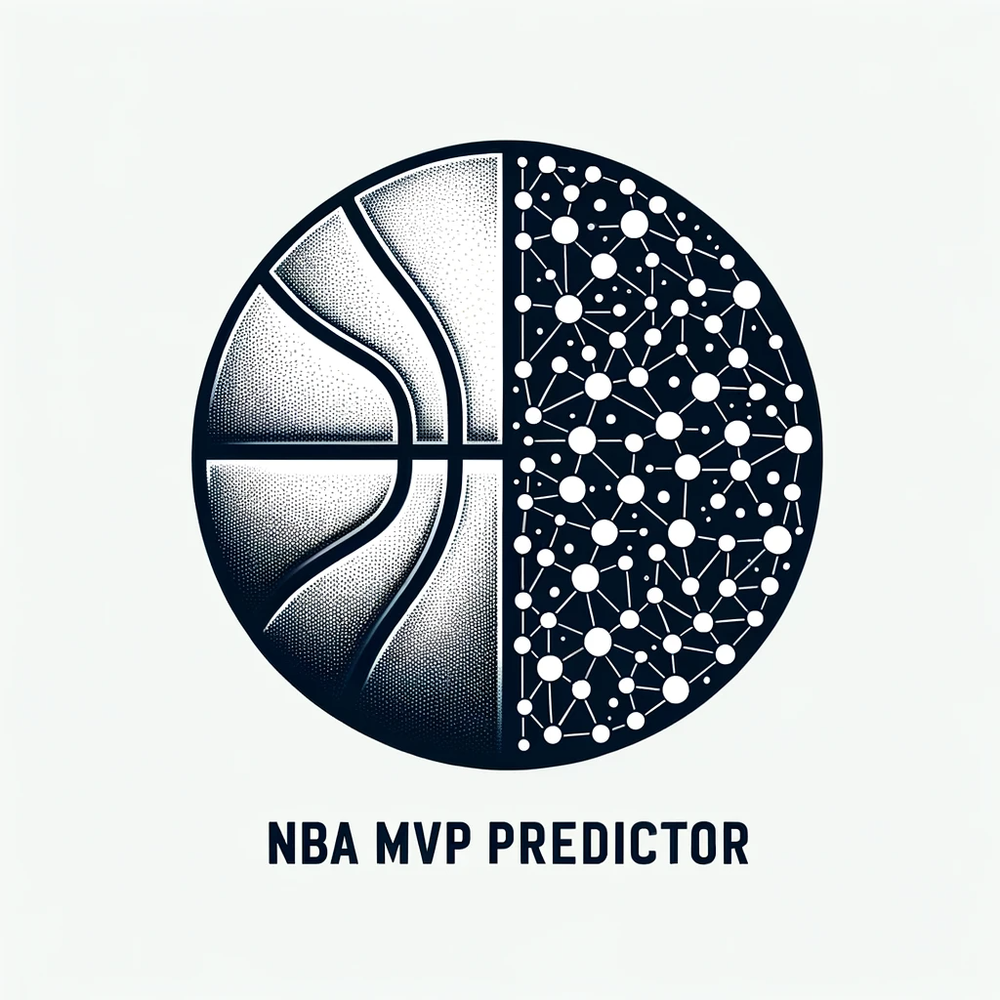

# **NBA Season MVP Predictor** 🏀

  

## Overview
The **NBA Season MVP Predictor** project focuses on predicting the NBA player most likely to win the MVP award for the season. The award has been given out since the 1955-56 season, recognizing the top performer of the regular NBA season. 

Learn more about the MVP award's history on [Wikipedia](https://en.wikipedia.org/wiki/NBA_Most_Valuable_Player_Award).

🔍 Explore the predictor's results via our deployed [Streamlit application](https://share.streamlit.io/al-kost/nba-season-mvp-predictor/main).

## Key Challenges

### 1. Imbalanced Data
With only one MVP each year amidst hundreds of players, the data imbalance is stark.

**Solutions**:
- **Target Variable**: Instead of the MVP award, use the MVP share. This allows for a regression model, as multiple players receive votes every season.
- **Data Filtering**: Set thresholds to exclude non-MVP contenders:
  - Players participating in over 50% of season games.
  - Players with a minimum of 24 minutes playtime per game.
  - Players from teams ranking within the top-10 in their conference.

### 2. Label Inconsistency
MVP winners may vary year-on-year, even with consistent stats, depending on the competition.

**Solutions**:
- **Stat Normalization per Season**:
  - Employ min-max scaling.
  - Standardize the data.

## Data Source
All statistical data for this project was meticulously scraped from [Basketball Reference](https://www.basketball-reference.com/). A heartfelt thank you to the creators for such a comprehensive and user-friendly database.
